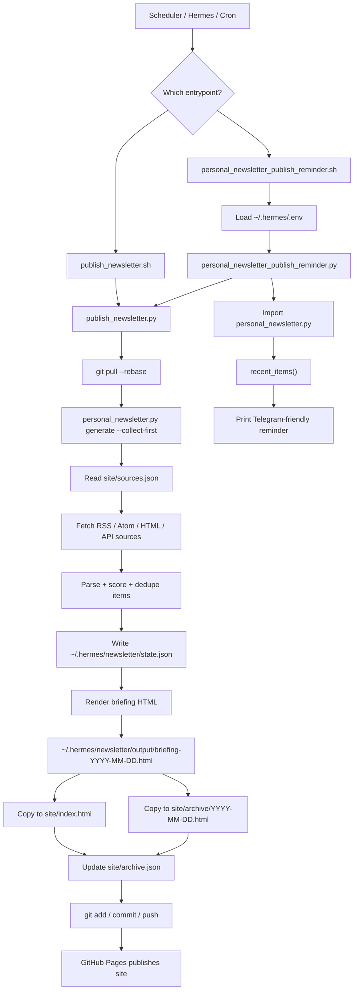
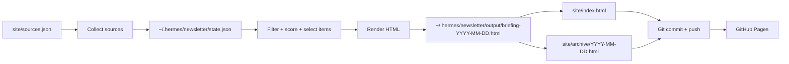
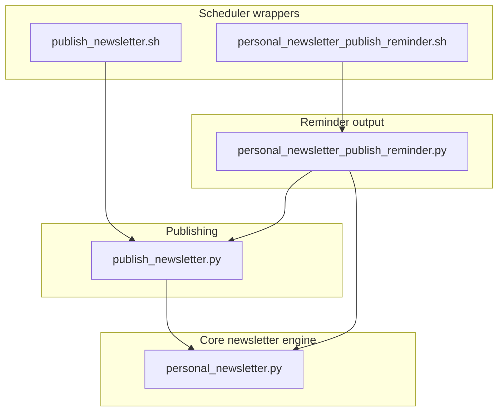

# Daily Newsletter Script Architecture

There are multiple scripts because the job is split into layers:

- newsletter generation
- publishing to the static GitHub Pages site
- reminder text generation
- shell wrappers for schedulers such as Hermes or cron

This keeps the core newsletter logic separate from deployment and notification concerns.

## Script Roles

### `scripts/personal_newsletter.py`

This is the core engine.

It does the actual newsletter work:

- reads source config from `site/sources.json`
- fetches RSS, Atom, HTML pages, and API feeds
- parses source items into a common item format
- scores items by source tier, keywords, and theme
- filters by recency, language, score, and duplicate titles
- stores collected state in `~/.hermes/newsletter/state.json`
- renders the final HTML newsletter into `~/.hermes/newsletter/output/briefing-YYYY-MM-DD.html`

It exposes two CLI commands:

```bash
python3 scripts/personal_newsletter.py collect
python3 scripts/personal_newsletter.py generate --collect-first
```

`collect` fetches and stores items.

`generate --collect-first` fetches fresh items first, then renders the HTML.

### `scripts/publish_newsletter.py`

This is the publishing layer.

It:

- runs `git pull --rebase origin main`
- runs `personal_newsletter.py generate --collect-first`
- finds the generated HTML in `~/.hermes/newsletter/output/`
- copies it to `site/index.html`
- copies it to `site/archive/YYYY-MM-DD.html`
- updates `site/archive.json`
- commits the changed site files
- pushes to GitHub

This is the script that turns the generated newsletter into the public GitHub Pages site.

### `scripts/personal_newsletter_publish_reminder.py`

This is the publish plus reminder layer.

It:

- runs `publish_newsletter.py`
- imports `personal_newsletter.py`
- calls `recent_items()`
- selects critical must-read items
- prints a Telegram-friendly reminder message

It does not send Telegram itself. It only prints the message. Hermes or another automation layer can forward that output.

### `scripts/publish_newsletter.sh`

This is a thin shell wrapper around `publish_newsletter.py`.

It:

- enables strict shell mode with `set -euo pipefail`
- changes directory to `$HOME/projects/daily_newsletter`
- runs `python3 scripts/publish_newsletter.py`

This exists so a scheduler can call one stable shell command.

### `scripts/personal_newsletter_publish_reminder.sh`

This is the production/scheduler wrapper for publishing and reminder output.

It:

- changes directory to `${NEWSLETTER_REPO:-$HOME/projects/daily_newsletter}`
- loads environment variables from `$HOME/.hermes/.env` if present
- runs `python3 scripts/personal_newsletter_publish_reminder.py`

This is likely the best entrypoint for Hermes because it loads secrets/config first.

## High-Level Architecture



## Data Flow



## Responsibility Split



## Short Version

- `personal_newsletter.py` builds the newsletter.
- `publish_newsletter.py` publishes it to the static site and pushes to GitHub.
- `personal_newsletter_publish_reminder.py` publishes, then prints a reminder message.
- `.sh` files are stable scheduler entrypoints.

The architecture is simple but layered: generation is reusable, publishing is separate, and notification is optional on top.
